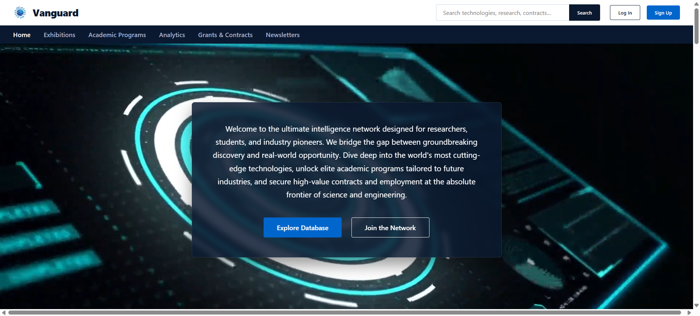

# Cutting Edge Technology

### **Vanguard Tech Evolution Portal**

Welcome to the primary entry point for **Vanguard**. This landing page is an amalgamation of all directions and resources visitors need regarding the company's products and services. It functions as a complete "Tech Evolution Portal," providing students, industry employees, and technology enthusiasts with a direct portal to the absolute future of technology[cite: 1].

## Project Preview



---

## 🌐 Project Overview

This landing page serves as the digital front door for Vanguard's tech exhibition operations. It centralizes several key pathways[cite: 1]:
* **Learning Portals:** Deep-dive directories into foundational and emerging technical knowledge bases[cite: 1].
* **Employment Opportunities:** Direct pipelines connecting qualified professionals to open career roles[cite: 1].
* **Institutional Directories:** Curated listings of leading tech institutions offering open opportunities for both learners and employees[cite: 1].

---

## 🛠️ Built With

* **React** — Component-driven UI framework[cite: 1]
* **Vite** — High-performance frontend build tool[cite: 1]
* **JavaScript (ES6+)** — Dynamic core programming logic[cite: 1]
* **Node.js** — Local server environment management[cite: 1]
* **CSS3** — Custom technical grids and responsive styling[cite: 1]
* **HTML5** — Semantic framework structure[cite: 1]

---

## 💻 Installation & Local Setup

To run this project locally on your machine, run these commands in your terminal[cite: 1]:

```bash
git clone [https://github.com/shepherd-bit/cutting-edge-tech.git](https://github.com/shepherd-bit/cutting-edge-tech.git)
cd cutting-edge-tech
npm install
npm run dev